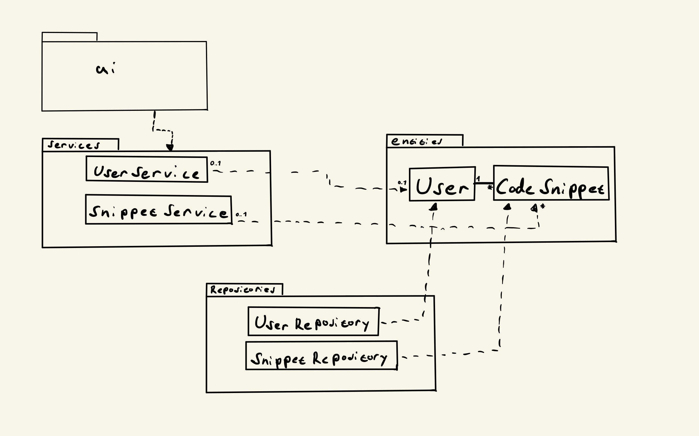
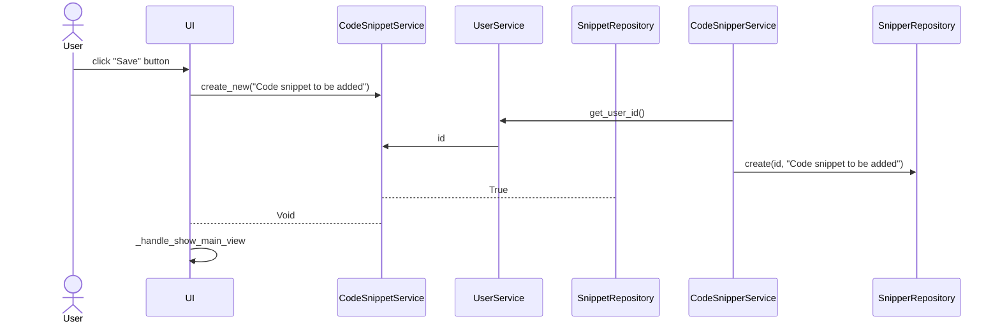

## Arkkitehtuurikuvaus

### Alustava rakenne pakkauskaaviona

### Päätoiminnallisuudet

Sovelluksen päätoiminnallisuuden kuvaaminen sekvenssikaavioina.

#### Uuden koodinpätkän tallentaminen

Painikkeen painamiseen reagoiva tapahtumankäsittelijä kutsuu koodinpätkien sovelluslogiikasta vastaavan CodeSnippetService metodia create new, antaen parametriksi lisättävän koodinpätkän. CodeSnipperService kutsuu käyttäjätietojen sovelluslogiikasta vastaavan UserService metodia get_user_id(), pyytäen siltä sisäänkirjautuneen käyttäjän id-tunnuksen. Kun tunnus on saatu, CodeSnippetServise kutsuu koodinpätkien tietokantaoperaatioista vastaavan SnipperRepository luokan metodia create, antaen sille parametreina tallennuksen tehneen käyttäjän id-numeron ja tallennettavan koodinpätkän. UserRepository palauttaa True tallennuksen onnistuessa ja CodeSnippetServicestä palataan takaisin käyttöliittymään. Tämän seurauksena käyttöliittymän näkymästä palataan takaisin sovelluksen etusivulle.