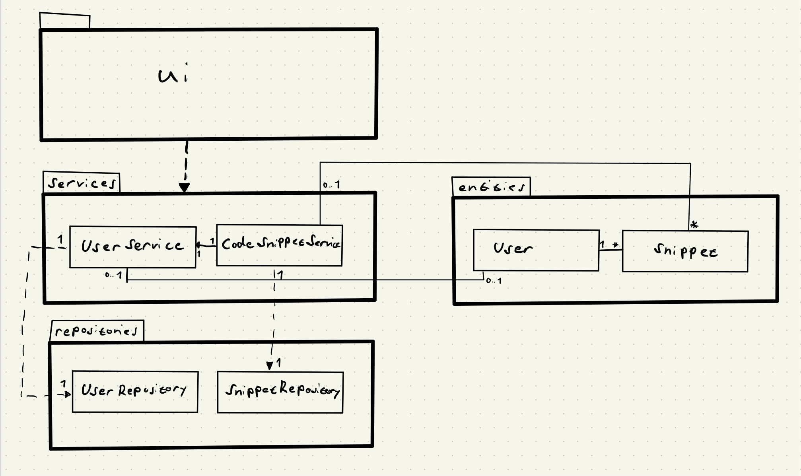

# Arkkitehtuurikuvaus

## Rakenne

Ohjelma on rakennettu noudattamaan Repository-suunnittelumallia.
Pakkauskaavio:


Hakemisto ui sisältää käyttöliittymästä vastaavan koodin.
Hakemisto services sisältää sovelluslogiikasta vastaavan koodin.
Hakemisto repositories sisältää tietokantaoperaatioista vastaavan koodin.
Hakemisto entities sisältää tietokohteita kuvaavat luokat.

## Käyttöliittymä

Käyttöliittymä koostuu viidestä erillisestä näkymästä:

- Rekisteröityminen
- Kirjautuminen
- Etusivu
- Koodinpätkän lisääminen
- Asetukset

Jokainen näkymä on toteutettu omana luokkanaan. Kerrallaan näkyvissä on yksi näkymä. Näkymien näyttämisestä vastaa [UI](https://github.com/jhakkari/ot-harjoitustyo/blob/master/src/ui/ui.py) -luokka. Käyttöliittymä ohjaa sovelluksen toimintaa kutsumalla omista osistaan vastaavia sovelluslogiikan [UserService](https://github.com/jhakkari/ot-harjoitustyo/blob/master/src/services/user_service.py) ja [CodeSnippetService](https://github.com/jhakkari/ot-harjoitustyo/blob/master/src/services/snippet_service.py) -luokkien metodeja.

Kun sovelluksen etusivun tilanne muuttuu, eli kun sovellukseen kirjaudutaan, koodinpätkä lisätään tai poistetaan, etusivun tallennetut koodinpätkät sisältävä lista päivitetään kutsumalla sovelluksen metodia initialize_snippet_list, joka rakentaa näkymän uudelleen `CodeSnippetService`:ltä saamansa olioita sisältävän listan perusteella.

Etusivu
- Sovelluksen päänäkymä. Sisältää kaiken keskeisen tiedon.
- Tallennetut koodinpätkät listana.
    - Napit koodinpätkien poistamiseen ja kopioimiseen käyttäjän tietokoneen leikepöydälle.
- Napit liikkumiseen sovelluksen eri näkymien välillä.
- Alue, joka näyttää ilmoituksia käyttäjän toiminnasta (tallennetun koodinpätkän poistaminen...).

Koodinpätkän lisääminen
- Kenttä, johon koodinpätkä lisätään ja jossa sitä voi muokata ennen tallentamista. Käyttäjän leikepöydän sisältö kopioidaan muokattavaksi automaattisesti.
- Napit tallentamiseen ja toiminnon perumiseen.
- Alue, joka näyttää ilmoituksia käyttäjän ja sovelluksen toiminnasta (Annettu syöte ei kelpaa, ilmoitus leikepöydän sisällön kopioinnista...).

Asetukset
- Nappi käyttäjätilin ja kaiken datan poistamiseen.
- Nappi etusivulle palaamiseen.

Rekisteröityminen
- Kentät rekisteröitymiseen vaadittavien tietojen syöttämiseen.
- Napit rekisteröitymiseen ja takaisin kirjautumiseen siirtymiseen.
- Mahdollisista virheistä ilmoittava alue.

Kirjautuminen
- Kentät käyttäjätunnuksen ja salasanan antamiseen.
- Napit kirjautumiseen ja rekisteröitymiseen siirtymiseen.
- Mahdollisista virheistä ilmoittava alue.

## Sovelluslogiikka

Sovelluksen tietomallin muodostavat luokat [User](https://github.com/jhakkari/ot-harjoitustyo/blob/master/src/entities/user.py) ja [Snippet](https://github.com/jhakkari/ot-harjoitustyo/blob/master/src/entities/snippet.py), jotka kuvaavat käyttäjiä ja heidän tallentamiaan koodinpätkiä.


Sovelluksen toimintalogiikka on jaettu kahteen osaan: luokka [UserService](https://github.com/jhakkari/ot-harjoitustyo/blob/master/src/services/user_service.py) vastaa kaikesta sovelluksen käyttäjiin liittyvästä logiikasta ja pitää kirjaa hetkellä kirjautuneesta käyttäjästä. Luokka tarjoaa toimintalogiikan toiselle osalle sekä käyttöliittymän toiminnoille metodeja, joita ovat esimerkiksi:

- `register(username, password, password_confirmation)`
- `login(username, password)`
- `login_status()`
- `get_user_id()`

Koodinpätkiin liittyvästä toimintalogiikasta vastaa luokka [CodeSnippetService](https://github.com/jhakkari/ot-harjoitustyo/blob/master/src/services/snippet_service.py). Luokka tarjoaa toiminnallisuutta käyttöliittymälle mm. seuraavien metodien muodossa:

- `create_new(content)`
- `get_snippets_list()`
- `remove(snippet_id)`
- `get_clipboard_contents()`

_UserService_ pääsee käsiksi tietokannassa oleviin käyttäjätietoihin [UserRepository](https://github.com/jhakkari/ot-harjoitustyo/blob/master/src/repositories/user_repository.py):n kautta. Vastaavasti _CodeSnippetService_ pääsee koodinpätkiin liittyviin tietoihin [SnippetRepository](https://github.com/jhakkari/ot-harjoitustyo/blob/master/src/repositories/snippet_repository.py):n kautta. Molemmat repositoriot löytyvät _repositories_ hakemistosta.

Luokkakaavio:



## Tietojen pysyväistallennus

Pakkauksen _repositories_ luokat `UserRepository` ja `SnippetRepository` vastaavat tietojen tallennuksesta SQLite-tietokantaan. Luokat noudattavat Repository -suunnittelumallia.

`UserRepository` vastaa käyttäjiin liittyvien tietojen tallentamisesta tietokannan `users` tauluun seuraavassa formaatissa:
```
käyttäjän yksilöivä id-tunniste | käyttäjätunnus | salasana
```

`SnippetRepository` taas huolehtii koodinpätkien tallentamisesta tietokannan tauluun `snippets` seuraavassa muodossa:
```
koodinpätkän yksilöivä id-tunniste | lisänneen käyttäjän id-tunniste | koodinpätkän sisältö | luontiaika
```

Tietokanta alustetaan ennen ohjelman käyttämistä, tiedostossa [initialize_db.py](https://github.com/jhakkari/ot-harjoitustyo/blob/master/src/initialize_db.py)


## Päätoiminnallisuudet

### Käyttäjän kirjautuminen

Kun kirjautumisnäkymän kenttiin kirjoitetaan käyttäjätunnus ja salasana, sekä painetaan _Login_ nappia, sovelluksen kontrolli etenee seuraavasti:


Tapahtumankäsittelijä kutsuu käyttäjistä vastaavan sovelluslogiikan `UserService` metodia login, antaen parametreiksi syötetyn käyttäjätunnuksen ja salasanan. Sovelluslogiikka hakee käyttäjän tallennetut tiedot käyttäjätietojen tietokantaoperaatioista vastaavan `UserRepository` avulla. Mikäli tiedot löytyvät, eli käyttäjätunnus on olemassa, UserServicelle palautetaan käyttäjän id, käyttäjätunnus ja salasana. Mikäli käyttäjän syöttämä salasana vastaa tietokannasta haettua, sovelluslogiikka luo haetuista tiedoista User-olion ja tallentaa sen omaksi attribuutikseen. Attribuutiksi tallennetaan vielä tieto kirjautumisen onnistumisesta. Lopuksi UI:n tapahtumankäsittelijä kysyy vielä sovelluslogiikalta kirjautumisen tilaa. Saadessaan tiedon kirjautumisen onnistumisesta, käyttöliittymä vaihtaa vaihtaa näkymäksi etusivun, eli sovelluksen päänäkymän.


### Uuden käyttäjän luominen

Kun kirjautumisnäkymän syötekenttiin kirjoitetaan käyttäjätunnus, salasana ja salasana toistamiseen, olettaen että käyttäjätunnus ei ole vielä käytössä, etenee sovelluksen kontrolli seuraavasti:


Tapahtumankäsittelijä kutsuu käyttäjistä vastaavan sovelluslogiikan metodia register antaen parametreiksi käyttäjätunnuksen, salasanan ja salasan vahvistuksen. Sovelluslogiikka tarkastaa `UserRepository`:n avulla, löytyykö käyttäjänimeä tietokannasta jo entuudestaan. Mikäli ei löydy, sovelluslogiikka tarkastaa annetut syötteet (salasanat vastaavat toisiaan, kentät eivät ole tyhjiä... ). Mikäli kaikki täsmää, sovelluslogiikka kutsuu `UserRepository`:n metodia create, joka lisää käyttäjän tiedot tietokantaan. Rekisteröityminen on nyt valmis ja sovellus jatkaa suoraan kirjautumiseen kutsumalla sovelluslogiikan metodia login. Kirjautumisen eteneminen on kuvattu edellisessä kohdassa.


### Uuden koodinpätkän tallentaminen

Koodinpätkän tekstikenttään kirjoittamisen ja sen tallentavan painikkeen `Save` painamisen jälkeen sovelluksen kontrolli etenee seuraavasti:


Painikkeen painamiseen reagoiva tapahtumankäsittelijä kutsuu koodinpätkien sovelluslogiikasta vastaavan CodeSnippetService metodia create new, antaen parametriksi lisättävän koodinpätkän. CodeSnipperService kutsuu käyttäjätietojen sovelluslogiikasta vastaavan UserService metodia get_user_id(), pyytäen siltä sisäänkirjautuneen käyttäjän id-tunnuksen. Kun tunnus on saatu, CodeSnippetServise kutsuu koodinpätkien tietokantaoperaatioista vastaavan SnipperRepository luokan metodia create, antaen sille parametreina tallennuksen tehneen käyttäjän id-numeron ja tallennettavan koodinpätkän. UserRepository palauttaa True tallennuksen onnistuessa ja CodeSnippetServicestä palataan takaisin käyttöliittymään. Tämän seurauksena käyttöliittymän näkymästä palataan takaisin sovelluksen etusivulla.

### Koodinpätkän kopioiminen

koodinpätkän kopioimisen `Copy`napin painamisen jälkeen kontrolli siirtyy seuraavasti:


Painikkeen painamiseen reagoiva taphtumankäsittelijä kutsuu koodinpätkien hallinnasta vastaavan CodeSnippetServicen metodia set_clipboard_contents, antaen parametriksi käyttäjän leikepöydälle kopioitavan koodinpätkän. 

## Muut toiminnallisuudet

Ohjelman muut toiminnallisuudet siirtävät kontrollisia samaan tapaan yllä mainittujen kanssa. UI:n tapahtumankäsittelijä ohja siis sovelluksen toimintaa sovelluslogiikasta vastaavien luokkien kautta. CodesnippetService hoitaa kopioinnin Pyperclipin copy metodin avulla. Tämän jälkeen CodeSnippetService antaa ilmoituksen kopioinnin suorittamisesta käyttöliittymälle, joka näyttää sen käyttäjälle.

## Ohjelman rakenteeseen jääneet heikkoudet

### Käyttöliittymä

Graafisen käyttöliittymän `MainView` ja `AddSnippetView` näkymissä ikkunan kasvattaminen aiheuttaa ongelmia. Ilmoituksia käyttäjälle hänen toiminnastaan näyttävä `action_feedback_area`, joka on `action_feedback_frame`:n sisällä, ei pysy ankkuroituneena ikkunan alareunaan sen kokoa kasvattaessa. Uusia koodinpätkiä lisättäessä mitään ei kuitenkaan jää sen alle, tai näyttämättä käyttäjälle, mutta ikkunan kasvattaminen luo puutteellisen ankkuroinnin takia pystysuunnassa tyhjää tilaa.

### Sovelluslogiikka

Tietokannasta haetun tiedon olisi voinut muuttaa User ja Snippet olioiksi suoraan tietokantaoperaatioista vastaavissa repositioissa. Nyt sovellus siirtää tietokannasta haetut tiedot riveinä services-tasolle, joka muuntaa niistä tarvittaessa olioita. 