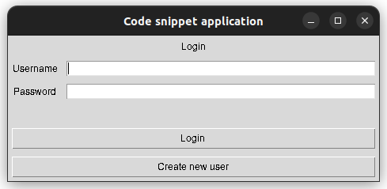
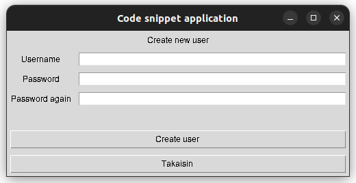
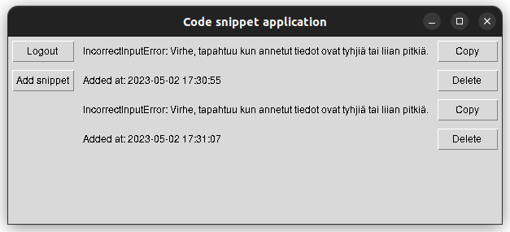
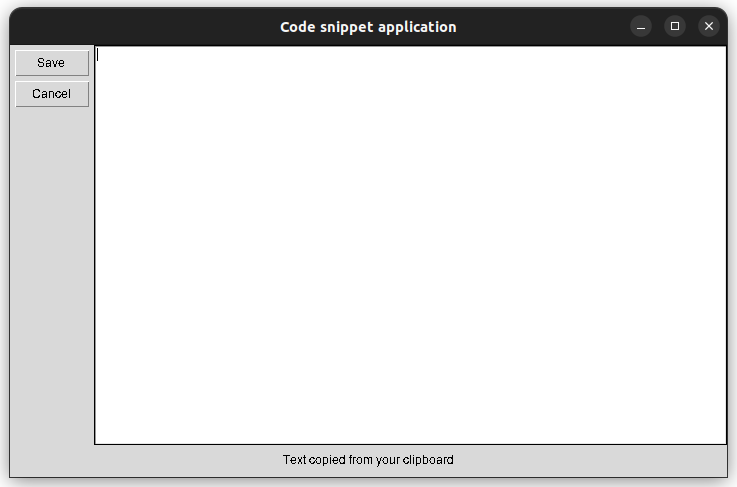

# Käyttöohje

Lataa sovelluksen viimeisin release projektin etusivulta.

## Ohjelman käynnistäminen

1. Asenna riippuvuudet komennolla:

```bash
poetry install
```

2. Alusta tietokanta komennolla:

```bash
poetry run invoke build
```

3. Käynnistä sovellus komennolla:

```bash
poetry run invoke start
```
Huom!
Sovellus käyttää riippuvuutenaan pyperclip moduulia. Tämän pitäisi toimia ongelmitta Windows, Mac ja Linux laitteilla.
Ongelmatilanteessa lisätietoa [täältä](https://pypi.org/project/pyperclip/)


## Kirjautuminen

Sovellus käynnistyy kirjautumisnäkymään:




Kirjautuminen onnistuu olemassaolevalla käyttäjätunnuksella ja salasanalla, sekä painamalla "Login"-näppäintä.

## Uuden käyttäjän rekisteröinti

Uuden käyttäjän luominen on mahdollista siirtymällä rekisteröitymisnäkymään, painikkeella "Create new user".

Luo uusi käyttäjä antamalla vaaditut tiedot ja painamalla "Create user"-näppäintä.




Käyttäjätilin luomisen onnistuessa siirrytään sovelluksen etusivulle.


## Koodinpätkien tallentaminen
Voit tallentaa koodinpätkän painamalla sovelluksen etusivulla "Add snippet" painiketta.




Leikepöydän sisältö kopioidaan automaattisesti. Tee tarvittavat muutokset ja paina "Add"-näppäintä


